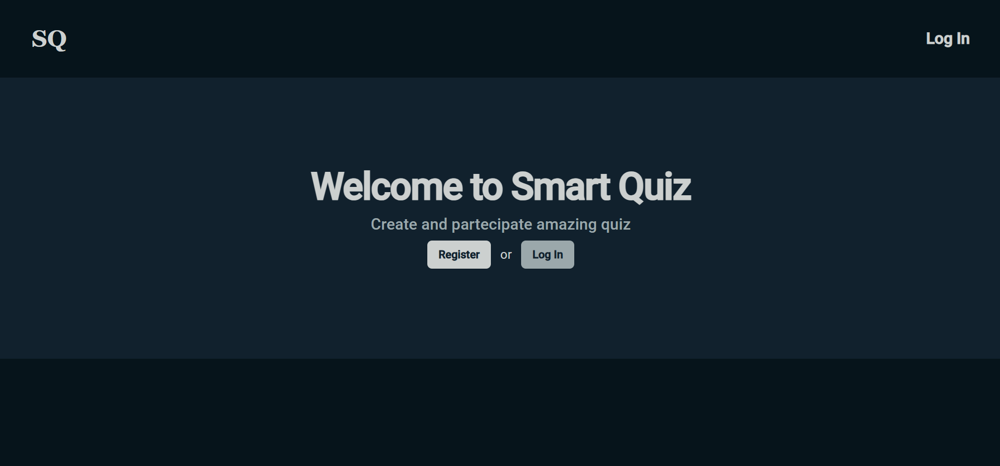
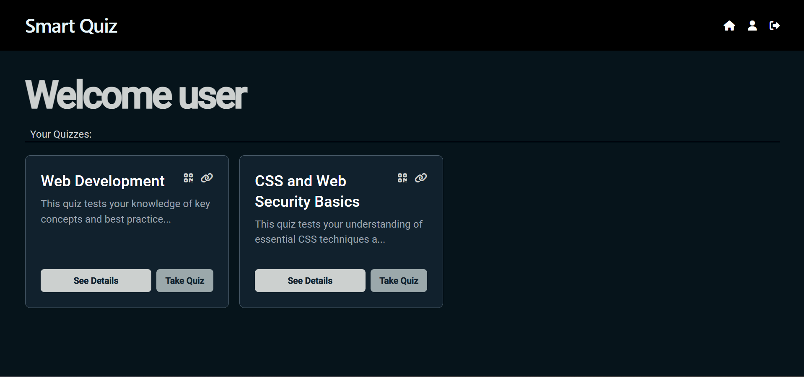
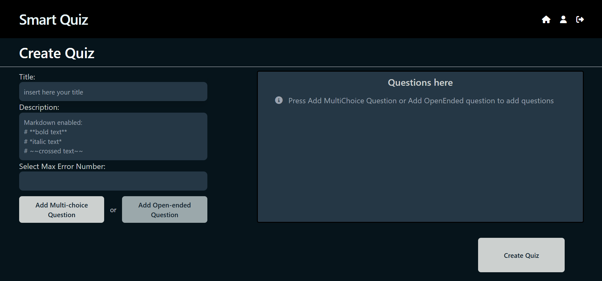
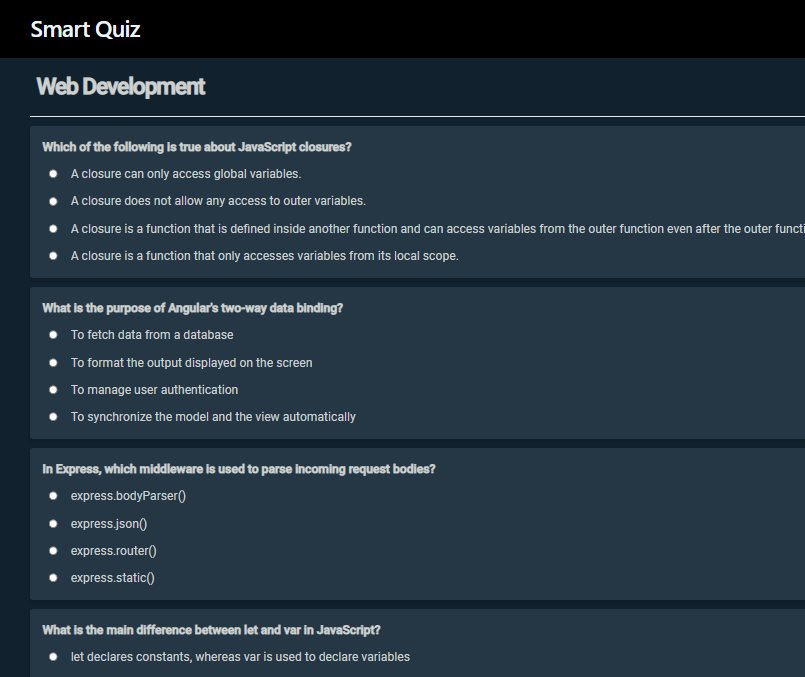

# SmartQuiz

SmartQuiz is an application for managing quizzes, with a backend developed in Node.js and a frontend based on Angular.

SmartQuiz enables you to send quizzes to specific target users, making it ideal for educators, team leaders, or anyone who wants to engage their audience interactively. The platform ensures a seamless experience from quiz creation to response collection, providing insights and analytics to measure participation and outcomes.

Prerequisites
Before you begin, make sure you have installed:

**Node.js**
**npm**

# Backend Configuration

---

Go to the backend directory:

```bash
cd back-end
npm install
npm start
```

# Frontend Configuration

---

Go to the frontend directory:

```bash
cd front-end
npm install
npm start
```

# Hero Page Screenshot

---



# Profile Page Screenshot

---



# Create Quiz Page Screenshot

---



# Take Quiz Page Screenshot

---


